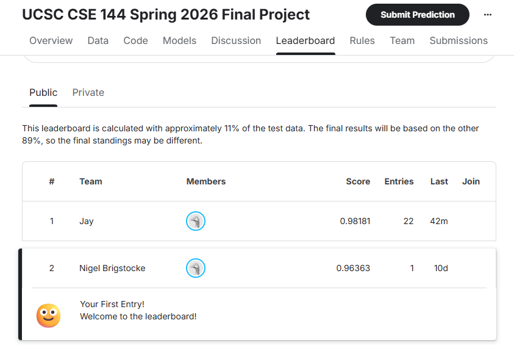

# CSE 144 Final Project — Transfer Learning Challenge

100-class fine-grained image classification with about 10 training images per class.
The model uses frozen SigLIP-2 features with a logistic-regression probe, plus multi-view
TTA, zero-shot text fusion, and a transductive balanced-prior step.

Public Kaggle leaderboard: 0.96363 (2nd place).

- Project report (PDF): [docs/CSE144_Final_Report.pdf](docs/CSE144_Final_Report.pdf)
- Slideshow: https://docs.google.com/presentation/d/1B02kFSv856GwDBmgaTtph6v_HqySgeu7UbrKw7Dmznc/edit?usp=sharing
- Trained model weights (Google Drive): https://drive.google.com/file/d/15Ptw6dtCjSfkU3Bgp2yWOea5LfOVEusu/view?usp=sharing

The report and slideshow cover the dataset, experimental setup, ablations, and results.

## Kaggle leaderboard



Public leaderboard: 0.96363, 2nd place.

## Setup

```bash
pip install torch torchvision --index-url https://download.pytorch.org/whl/cu121
pip install -r requirements.txt
```

Get the competition data:

```bash
export KAGGLE_API_TOKEN=KGAT_xxxxxxxx     # or ~/.kaggle/access_token
kaggle competitions download -c ucsc-cse-144-spring-2026-final-project -p data
python -c "import zipfile; zipfile.ZipFile('data/ucsc-cse-144-spring-2026-final-project.zip').extractall('data')"
```

Data layout: `data/train/<0..99>/*.jpg`, `data/test/<id>.jpg`, `data/sample_submission.csv`.

## Training

The model is a logistic probe on top of a frozen backbone, so there is no fine-tuning loop.
Stage 1 (feature extraction) is the only GPU step. Stage 2 (the probe) is a convex logistic
regression and is deterministic (seed = 42).

```bash
# 1) Extract frozen features -> cached to outputs/feats/  (GPU)
python src/extract_features.py --backbone vit_so400m_patch14_siglip_378.v2_webli \
    --batch_size 8 --tta multi --out_suffix _tta

# 2) Cache the SigLIP-2 zero-shot text probabilities
python src/zeroshot_siglip.py --names_csv data/class_names.csv

# 3) Fit and save the logistic probe -> outputs/model/probe_siglip2_so400m.joblib
python src/save_model.py
```

Probe settings: multinomial logistic regression, C=8, class_weight=balanced, L-BFGS.
Fusion weight w=0.35, Sinkhorn temperature tau=0.4.

## Inference

```bash
python src/predict_fused.py --w 0.35 --tau 0.4 --out outputs/submission_fused.csv
```

This writes an ID,Label CSV in sample_submission.csv order.

The trained model weights are available at the Google Drive link above.

## Repository contents

```
src/                              all source code
src/extract_features.py           frozen-backbone feature extraction (multi-view TTA)
src/zeroshot_siglip.py            SigLIP-2 zero-shot text probabilities
src/save_model.py                 fit and serialize the logistic probe
src/predict_fused.py              inference -> submission.csv
src/train.py, src/predict.py      optional ConvNeXt fine-tune baseline
configs/                          baseline hyperparameters
docs/CSE144_Final_Report.pdf      project report
docs/figs/kaggle_leaderboard.png  leaderboard screenshot
```
